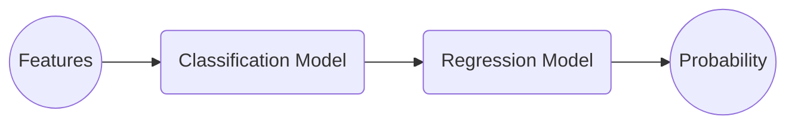

ต้องเกริ่นก่อนว่า machine learning มีปัญหา 2 ประเภท อย่างแรกคือ regression คือเราพยายามทำนายค่าจำนวนจริงออกมา เช่น อุณหภูมิ, ราคาหุ้น กับอีกอย่างคือ classification คือเราพยายามทำนายว่าอยู่กลุ่มไหน เช่น รูปนี้น่าจะเป็นรูปแมว, พรุ่งนี้ฝนน่าจะตก

แต่เวลาเอาไปใช้งานจริง บางทีเราไม่ได้อยากรู้แค่ว่ามันน่าจะอยู่กลุ่มไหน แต่อยากรู้ความน่าจะเป็นด้วย เช่น  คนไข้คนนี้น่าจะเป็นมะเร็ง 60% แบบนี้จะช่วยให้เอาไปใช้ตัดสินใจต่อได้ดีขึ้น เช่น หมออาจจะตัดสินใจให้ไปตรวจอย่างอื่นเพิ่มเติม เพื่อเพิ่มระดับความมั่นใจ

ทีนี้การทำงานของ classification model ปกติมันจะไม่ได้พ่น probability ออกมาให้ตรงๆ เช่น ถ้าใช้ [decision tree](https://en.wikipedia.org/wiki/Decision_tree) หรือ [SVM](https://en.wikipedia.org/wiki/Support_vector_machine) ตามธรรมชาติของ model มันบอกได้แค่ว่าอยู่ class ไหน

ถ้าใช้ [ANN](https://en.wikipedia.org/wiki/Neural_network_(machine_learning)) ปกติใน output layer เค้าจะใส่ sigmoid activation function ไว้ เพื่อให้ค่าที่ได้มันดูเหมือน probability แต่ในความเป็นจริง ค่าที่ได้มันมักจะ over-confident ไม่ใกล้ 0 ก็ใกล้ 1 ไปเลย ตามธรรมชาติของ model เพราะอย่าลืมว่ามันทำมาเพื่อแบ่งกลุ่ม เหมือนสอนให้เรารู้จักแมว โดยการให้เราดูรูปแมวเยอะๆ แล้วพอเอารูปหมามาให้ดู เราก็ตอบได้แหละว่าไม่ใช่แมว แต่ถามว่าคล้ายแมวกี่ percent มันก็ตอบยากป่ะล่ะ 555+ 😂

วิธีการทำให้ classification model พ่น probability ออกมาให้ หรือถ้าพ่นออกมาแล้วก็เป็นค่าที่ถูกต้องมากขึ้น เราเรียกว่าการทำ calibration โดยเป้าหมายคือ predicted probability ควรสะท้อนถึงโอกาสที่แท้จริงของเหตุการณ์นั้นๆ เช่น ถ้า predict ว่ารูปนี้น่าจะเป็นแมว 80% ไปทั้งหมด 100 ครั้ง ก็ควรจะเป็นรูปแมวจริงๆ 80 ครั้ง 🐱

โดยวิธีการก็ตรงไปตรงมาคือ เราจะ train regression model (ซึ่งมันเอาไว้ทำนายค่าจำนวนจริง โดยธรรมชาติ!) ขึ้นมา มี input เป็นค่าที่ได้จาก classification model แล้วมี output เป็น predicted probability โดย training data จะเป็น observed probability จากเหตุการณ์จริง



ทีนี้จะใช้ regression model อะไรก็แล้วแต่งานละ เช่น ง่ายๆเลยก็ใช้ logistic regression โดยจะมีชื่อเรียกว่า วิธี [Platt Scaling](https://en.wikipedia.org/wiki/Platt_scaling) ซึ่งง่ายดี แต่ข้อเสียคือมันเป็น [parametric model](https://en.wikipedia.org/wiki/Parametric_model) โดยเราต้อง assume ว่า probability curve เรามันหน้าตาเป็น sigmoid function 

ก็เลยมีอีกวิธี คือใช้ [Isotonic Regression](https://en.wikipedia.org/wiki/Isotonic_regression) ที่สามารถ fit กับ probabilty curve หน้าตาหลากหลายกว่า ข้อมูลน้อยๆก็ train ได้ นอกจากนั้นความเท่ก็คือ ranking ก่อนและหลัง calibrate จะยังเหมือนเดิมเสมอ! เช่น ถ้าก่อน calibrate เรา predict ว่ารูป A น่าจะเป็นแมวมากกว่า รูป B หลังจาก calibrate แล้วเราจะยังคง predict ว่ารูป A น่าจะเป็นแมวมากกว่า รูป B แค่ด้วยเลขที่เปลี่ยนไป ซึ่งเป็นคุณสมบัติที่ดีงามมากๆในหลายๆ application

มาลอง train calibration model ด้วย python กัน

```python
import numpy as np
import matplotlib.pyplot as plt
from sklearn.svm import SVC
from sklearn.calibration import CalibratedClassifierCV, calibration_curve
from sklearn.datasets import make_classification
from sklearn.model_selection import train_test_split
from sklearn.isotonic import IsotonicRegression

X, y = make_classification(n_samples=3000, n_features=20, random_state=43)

X_train, X_test, y_train, y_test = train_test_split(X, y, test_size=0.2, random_state=43)

svm = SVC(kernel='linear', probability=True)
svm.fit(X_train, y_train)

calibrated_svm_platt = CalibratedClassifierCV(svm, method='sigmoid')
calibrated_svm_platt.fit(X_train, y_train)

calibrated_svm_isotonic = CalibratedClassifierCV(svm, method='isotonic')
calibrated_svm_isotonic.fit(X_train, y_train)

probs_svm = svm.predict_proba(X_test)[:, 1]
probs_platt = calibrated_svm_platt.predict_proba(X_test)[:, 1]
probs_isotonic = calibrated_svm_isotonic.predict_proba(X_test)[:, 1]

true_probs_svm, predicted_probs_svm = calibration_curve(y_test, probs_svm, n_bins=10)
true_probs_platt, predicted_probs_platt = calibration_curve(y_test, probs_platt, n_bins=10)
true_probs_isotonic, predicted_probs_isotonic = calibration_curve(y_test, probs_isotonic, n_bins=10)

plt.figure(figsize=(8, 6))
plt.plot(predicted_probs_svm, true_probs_svm, marker='o', label="SVM (Raw Probabilities)", color='blue')
plt.plot(predicted_probs_platt, true_probs_platt, marker='s', label="SVM (Platt Scaling)", color='red')
plt.plot(predicted_probs_isotonic, true_probs_isotonic, marker='^', label="SVM (Isotonic Regression)", color='green')
plt.plot([0, 1], [0, 1], linestyle="--", label="Perfect Calibration", color='black')
plt.xlabel("Predicted Probability")
plt.ylabel("True Probability")
plt.title("Calibration Curve: SVM vs Platt Scaling vs Isotonic Regression")
plt.legend()
plt.grid(True)
plt.show()
```

เราสามารถดูว่า model ของเรา well calibrated หรือเปล่าได้จาก calibration curve โดยจาก predicted proability ทั้งหมดที่เราทายมาเราจะมาแบ่งเป็นกองๆ เช่น แบ่งเป็น 10 กอง 0-0.1, 0.1-0.2, ... แล้วในแต่ละกองเราจะหาค่าเฉลี่ย predicted probability ของกองนั้น เทียบกับค่าเฉลี่ยของ true probability ของกองนั้น โดย ideal calibration curve จะเป็นเส้นตรง 45 องศา

โดย calibration curve ของ model หลัง calirated แล้ว ควรจะเข้าใกล้ diagonal line มากขึ้น (บ้าง 555)


